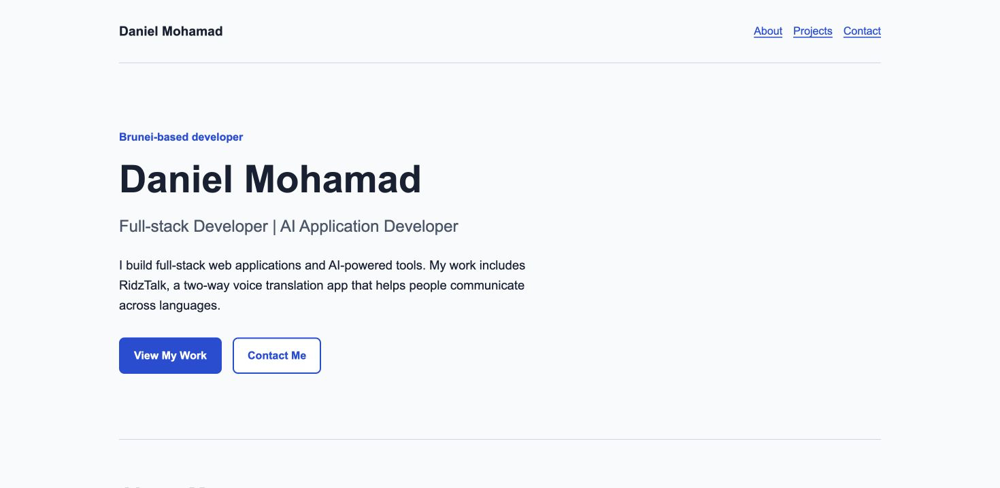

# Daniel Mohamad — Personal Portfolio

A personal portfolio showcasing my full-stack development and
AI application work, including RidzTalk, a two-way voice translator.

## Why I Built This

I built this website to introduce my background, demonstrate my
development skills, and help potential employers and freelance
clients explore my work and contact me.

It also puts my HTML, CSS, responsive design, and accessibility
knowledge into practice as part of The Odin Project.

## Preview



## Features

- An introduction and professional background.
- Technical skills grouped by purpose.
- A RidzTalk showcase with an app screenshot and Google Play link.
- Email, GitHub, LinkedIn, and CV links.
- A responsive layout for desktop and mobile screens.
- Semantic HTML, a keyboard skip link, and visible focus indicators.

## Technologies

- HTML
- CSS
- Git and GitHub

This portfolio is a static website. The technologies listed in
its RidzTalk section describe that separate application's stack.

## Run Locally

You need Git and Python 3 installed to use these commands.

Clone the repository:

```bash
git clone https://github.com/DannyRidz/Project-Building-Your-Personal-Website.git
```

Enter the project directory:

```bash
cd Project-Building-Your-Personal-Website
```

Start a local server:

```bash
python3 -m http.server 8000 --bind 127.0.0.1
```

Open http://127.0.0.1:8000 in your browser.

Press Ctrl+C in the terminal to stop the server.

Alternatively, open index.html directly in your browser.
No package installation or build command is required.

## Project Structure

- index.html — page content and structure.
- styles.css — visual styles and responsive layout.
- assets/images/ — portfolio and RidzTalk screenshots.
- assets/documents/ — public CV.

## Featured Project

[RidzTalk on Google Play](https://play.google.com/store/apps/details?id=com.polytalk.app)

RidzTalk supports two-way spoken conversations across languages
using transcription, translation, and voice playback.

Its source repository is private.

## Contact

- [GitHub](https://github.com/DannyRidz)
- [LinkedIn](https://www.linkedin.com/in/danielmohamad/)
- Email: daniel.ridzwan.mohamad@gmail.com

## Credits

Built as part of
[The Odin Project](https://www.theodinproject.com/lessons/node-path-getting-hired-building-your-personal-website).

The RidzTalk image comes from my app's Google Play listing.
